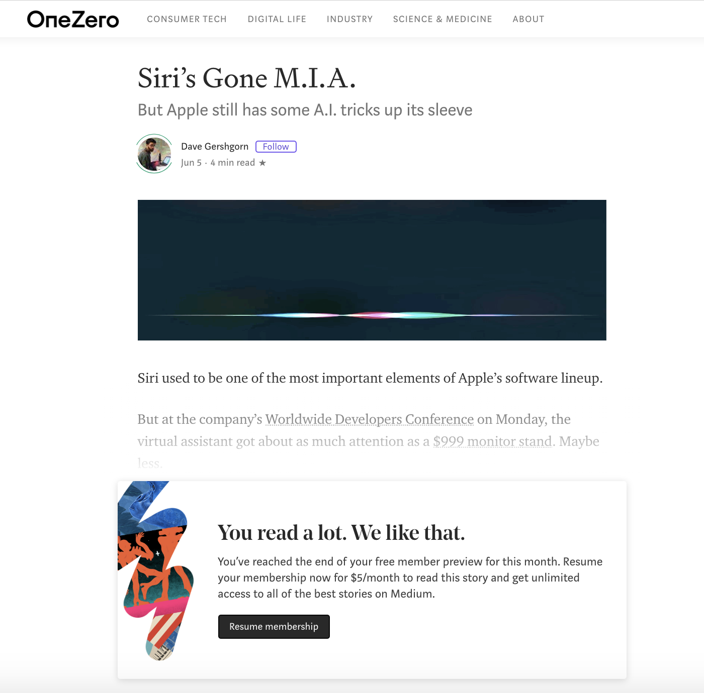

# Mediumship

[**USE IT AT YOUR OWN RISK!**](#disclaimer)

Try Medium with membership-features!

📚 Read all Medium stories for free.

Click on the page action button to read the full story.

## Download links (for Chrome and Firefox)

Get Mediumship on Google Chrome: https://chrome.google.com/webstore/detail/mediumship/bmiaaebehjjikccjanedpidhmpcbhnfg

Get Mediumship on Mozilla Firefox (Works both on desktop & mobile browsers!): https://github.com/swapagarwal/mediumship/blob/master/firefox/web-ext-artifacts/addon-2.2.xpi

## Demo

## Screenshots

Before                | After
:--------------------:|:-------------------:
 | 

## Disclaimer

This is an extension that demonstrates the ability to modify HTTP request headers to twitter url. Use it at your own risk! The same result can be achieved by the following ways without the extension:

- Use another device
- Use your browser's incognito mode
- Paste a url on your twitter textbox, select it and right-click `go to link`

This extension modifies the HTTP request header referrer as mentioned [here](https://twitter.com/ev/status/1100899021621583872).

We've emailed to Medium's security department about this issue, and the reply says that the method is not a vulnerability.

